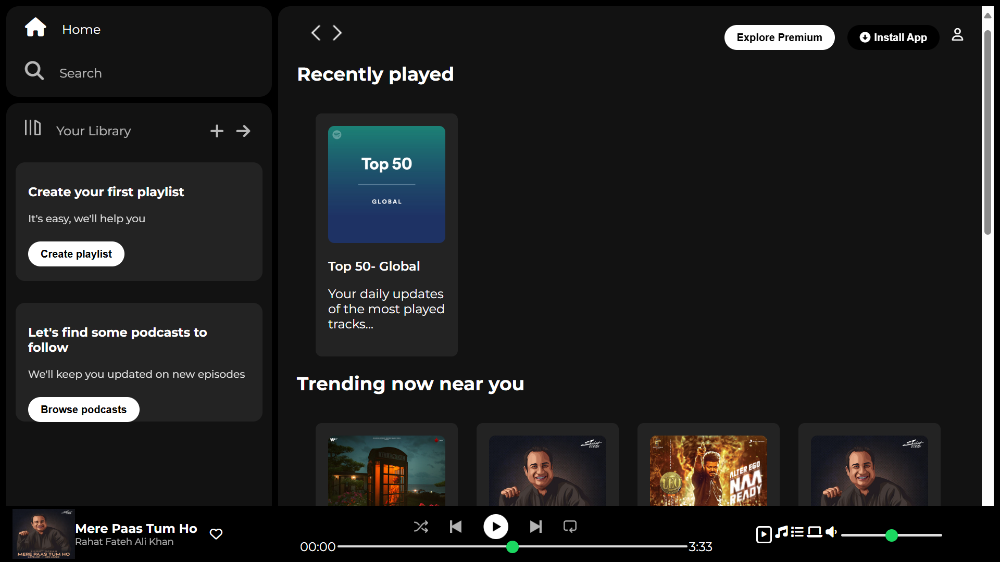
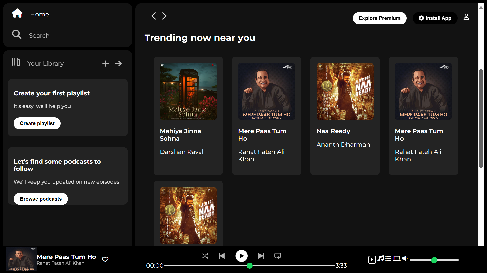

# Spotify Clone (Single Page) 🎨

Welcome to my single-page Spotify clone! This project is a simple design-focused webpage that mimics the look and feel of Spotify, created entirely with **HTML** and **CSS**.

## About 📖

This is a static, non-functional webpage designed to showcase my front-end development skills. It highlights my ability to replicate professional UI designs and create visually appealing layouts.

## Features 🟢

- **Spotify-Inspired Design**: The layout and aesthetics are modeled after Spotify's interface.
- **Static Webpage**: A non-interactive prototype focused purely on design.
- **Responsive Elements**: Styled sections like navigation bars, playlists, and a footer music player.

## Technologies Used 💻

- **HTML**: For structuring the webpage content.
- **CSS**: For styling and ensuring the webpage mirrors Spotify's design.

## Preview 🖼️




## How to View 🚀

1. Clone this repository to your local machine:
   ```bash
   git clone https://github.com/kashish-0019/spotify-clone.git